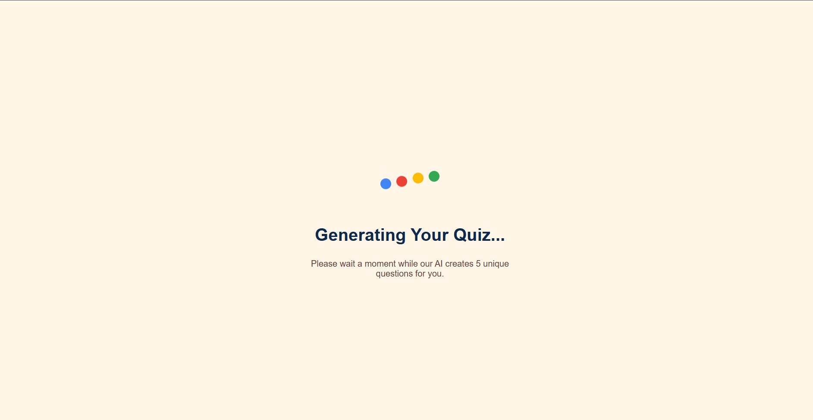

# Brain-X Quiz App

An AI-powered quiz generator that creates custom multiple-choice questions on literally any topic you can think of. Built with React and Google's Gemini AI.

---

## Quick Start

**Live version:** https://brain-x-e6kn.vercel.app/

**To run locally:**

```bash
npm install
npm start
```

Then open http://localhost:3000 and you're good to go!

---

## What I Built & Why

I wanted to create a quiz app where you're not limited to pre-made questions. You can type in ANY topic and get a quiz instantly.

The app generates 5 questions per quiz ( not too short, not too long). Each question has 4 options, and at the end you get personalized feedback from the AI based on how you did.

**A few things I had to figure out:**

- How to get consistent JSON responses from Gemini.
- Making sure the questions aren't too easy OR too hard.
- Handling cases where the AI returns weird/malformed data.

---

## The AI Integration (a bit tricky part)

### First attempt - total mess

My initial prompt was super basic:

```
Generate 5 quiz questions about [topic] in JSON format.
```

This gave me all kinds of problems:

- Sometimes got 3 questions, sometimes 8.
- Gemini would wrap everything in markdown code blocks
- The "correct answer" text wouldn't match the actual options
- Questions were either way too easy or impossibly hard

### What actually works

After a bunch of trial and error, I landed on this prompt structure:

```javascript
Create 5 multiple choice questions about "${topic}".

Requirements:
- Each question needs exactly 4 options
- Mix easy, medium, and hard difficulty
- Make sure options are realistic (not obviously wrong)
- Include different types: facts, concepts, and application questions

Return ONLY valid JSON array, no extra text or markdown.
```

The key was being REALLY specific about what I wanted and giving it an example of the exact JSON structure. I also had to add validation on my end because sometimes Gemini still tries to be creative with the format.

For the score feedback, I just send it the score percentage and ask for 2-3 encouraging sentences. Works pretty well!

---

## How It's Organized

```
src/
|- App.js                    # where all the state lives
|- geminiService.js          # handles API fetch and AI application
|- components/
|   |- HomeScreen.js         # topic selection page
|   |- LoadingScreen.js      # that animated loading page
|   |- QuizScreen.js         # the actual quiz interface
|   |- ResultScreen.js       # shows your score with AI feedback
|   |- ReviewScreen.js       # review all answers (green for correct /red for incorrect)
```

Pretty straightforward - App.js manages the overall state (which screen you're on, the questions, answers, etc.) and passes everything down to the components.

The geminiService file is where I talk to the AI - one function for generating questions, another for getting feedback on your score.

**Flow looks like this:**

```
Home -> Loading -> Quiz -> Results -> Review-> back to Home page

```

---

Screenshots

1. Home Screen - Topic Selection
   _Choose from preset topics or enter any custom topic_
   

2. Home Screen(dark mode)- topic selction
   _Choose from preset topics or enter any custom topic in dark mode_
   

3. Loading Screen
   _Animated loading with bouncing dots while AI generates questions_
   

4. Quiz Screen
   _Interactive quiz with progress bar and navigation buttons_
   

5. Results Screen
   _Final score with personalized AI-generated feedback_
   

6. Review Screen
   _Review all answers - green highlights correct, red shows incorrect_
   

---

## Things That Could Be Better

**Current issues:**

- API calls take 2-5 seconds (can't really fix this).
- No caching - every quiz hits the API again even for the same topic
- If the API fails, you just get an alert. Should probably add retry logic
- Only supports single choice questions
- issue with mobile gesture,some UI elements overlap due to collapsing margins and border conflict.

**Ideas for future:**

- Let users pick difficulty level before starting.
- Save quiz history.
- Add a timer for each question to make it more challenging.
- Support for true/false or fill-in-the-blank questions
- Let users export their results as PDF or something.
- Better mobile gestures.

---

## Cool Features I Added

Beyond the basic requirements, I added:

- **Dark mode** - toggle in the bottom right corner
- **Progress bar** - so you know how far along you are
- **Animated loading screen** - those bouncing dots with Google colors
- **Color-coded review** - green for correct, red for wrong answers
- **Preset topics** - buttons for quick access to common categories

---

## Tech Stack

- React 19.2.0
- Google Gemini AI (gemini-2.0-flash model)
- Plain CSS (no frameworks)
- Deployed on Vercel

---

## The Hardest Part

Getting consistent JSON from the AI was way harder than I expected. The problem is that language models aren't really designed to output structured data - they want to write sentences and paragraphs.

I ended up having to:

1. Clean the response (strip out markdown formatting)
2. Validate the structure (check for 5 questions, 4 options each, etc.)
3. Handle errors gracefully (show user-friendly messages, not technical errors)

It took a lot of testing with different prompts to figure out what works reliably.

---

## What I Learned

- **Prompt engineering is tough** - small changes in wording make huge differences in AI output
- **Always validate external API responses**
- **Async operations in React** - got more comfortable with promises and async/await.

---

## Setup

1. Clone this repo
2. Run `npm install`
3. Run `npm start`
4. browser Quiz page is ready!

---
